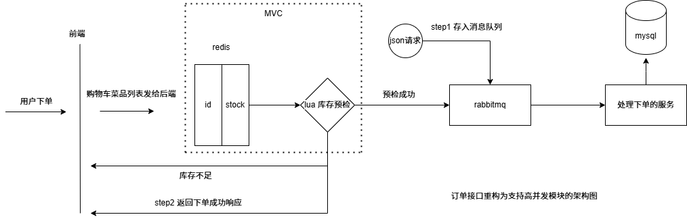

## 点餐项目高并发的调研实现

### 设计高并发的注意点

1. 优化数据库访问索引、减少数据库的锁竞争，采用合理的数据隔离级别(为查询频繁的字段添加索引)。
2. 使用本地缓存。需要注意缓存的一致性和失效策略，避免脏数据和缓存击穿。(Caffeine)
3. 将耗时操作转换为异步处理，使用消息队列(线程池)将耗时操作异步。
4. 考虑线程安全，使用锁

### 思路

#### 第一层：客户端直写MQ，异步削峰

用户点击点赞的瞬间，客户端向后端发送请求。
后端收到后，不直接操作Redis，也不操作数据库，而是把{userId, videold, action（赞/取消）}封装成一条消息，写入Kafka。只要消息成功入队，就立刻返回点赞成功给前端。这样百万请求被MQ稳稳接住，不会对后端造成任何冲击

#### 第二层：Redis实时状态 + 布隆过滤器

用户状态缓存：用Redis的Hash结构，以videold为key，存储userId -> action的映射。用户查看视频时，直接从Redis读取自己是否已点赞，响应毫秒级。
布隆过滤器兜底：如果Redis内存不够存所有用户，可以用布隆过滤器判断用户是否点赞过。有误判率但可以接受，毕竟用户看到“已赞”但实际没设的概率很低。
点赞数实时计算：用Redis的INCR维护点赞总数，被请求连接查Redis，性能炸裂

#### 第三层：异步批量落库，保证最终一致

消费端批量处理：从Kafka拉取消息，按视频ID分组，攒够一批（比如1000条）再批量更新数据库。更新时要根据用户ID和视频ID判断最终状态——如果同一个用户有赞、取消、再赞三条消息，以最后一条为准。
幂等设计：每条消息带全局唯一ID，消费前查Redis去重，防止重复处理。
定时对账修复：每天凌晨跑批，对比Redis和数据库的点赞数，发现不一致自动修复

> 暂定计划是将下订单的接口改为支持并发，希望我能实现吧。。。 

### 基于Spring Boot与RabbitMQ的用户下单接口高并发改造大纲

#### 一、项目背景与目标
- 当前系统现状分析：现有下单接口同步阻塞，数据库压力大，高峰期响应慢。
- 改造核心目标：实现下单接口的“削峰填谷”，将同步下单改造为异步处理，提升系统吞吐量。
- 预期性能指标：设定QPS提升目标（如从100提升至2000+），降低接口平均响应时间（RT）。

#### 二、总体架构设计
- 核心流程重构：从“同步下单”转变为“预下单+异步处理”模式。
- 组件交互图：客户端 -> Nginx -> Spring Boot Controller -> Redis (预检) -> RabbitMQ (缓冲) -> 消费者 (落库)。
- 技术选型确认：Spring Boot 2.x/3.x, RabbitMQ, Redis, MySQL, Lombok, FastJson/Jackson。

#### 三、第一阶段：库存预热与预检
- Redis库存同步：编写脚本将MySQL中的商品库存同步至Redis，利用Redis单线程原子性特性。
- 接口前置校验：在Controller层通过Lua脚本执行库存扣减预检。
- 快速失败机制：若Redis中库存不足，直接返回“售罄”提示，不再进入后续流程，保护下游服务。

#### 四、第二阶段：消息队列缓冲
- RabbitMQ环境搭建：定义下单交换机与下单队列。
- 消息体设计：设计轻量级的下单消息对象，包含用户ID、商品ID、数量、时间戳、唯一流水号。
- 生产者改造：Controller层在校验通过后，立即将订单信息封装为消息发送至RabbitMQ，并立即返回“排队中”状态给前端。
- 消息可靠性投递：配置ConfirmCallback和ReturnCallback，确保消息成功到达Broker。

#### 五、第三阶段：异步消费与订单落地
- 消费者监听器：编写RabbitListener监听下单队列。
- 数据库事务处理：在消费者中执行真正的数据库订单创建和库存扣减操作。
- 幂等性设计：利用数据库唯一键或Redis分布式锁，防止因网络抖动导致的消息重复消费。
- 异常处理与重试：配置Spring AMQP的重试策略，处理临时性数据库故障。

#### 六、第四阶段：死信队列与兜底机制
- 死信交换机配置：为下单队列绑定死信交换机。
- 异常消息处理：当消息消费失败超过阈值（如3次），将消息路由至死信队列。
- 人工/自动补偿：编写死信队列消费者，记录异常日志或触发告警，用于后续人工排查或自动退款。

#### 七、第五阶段：前端交互与状态轮询
- 响应模型变更：下单接口不再返回“成功/失败”，而是返回“受理成功”及一个临时订单号。
- 轮询机制：前端通过临时订单号每隔N秒轮询订单状态接口。
- 最终结果反馈：后端查询数据库，告知前端订单是“支付中”还是“下单失败（如库存不足）”。

#### 八、测试与验证
- 压力测试：使用JMeter或Wrk模拟高并发场景，对比改造前后的QPS和RT。
- 超卖验证：在测试环境中模拟库存临界情况，验证是否存在超卖现象。
- 故障演练：模拟RabbitMQ宕机或MySQL宕机，验证系统的恢复能力和数据一致性。

### 小优化点(未实现)
* 将订单id从自增1转换成雪花算法id防止爬虫

问题：
1，库存预热和预检能不能通过SpringDataRedis实现？会不会有原子性的冲突？如果是单个主机有没有线程安全的问题
2，rabbitmq要用原生java api还是spring集成的框架？
3，为什么配置ConfirmCallback和ReturnCallback能确保消息成功到达Broker(消息可靠性投递)？
4，Broker和消息队列里面的交换机、队列，生产者有什么关系？

##### 优化了根据分类查询菜品的接口，相比没优化之前平均延时对比
采用postman进行200次连续请求之后得到的平均延时(暂时取消缓存的对比)

数据请求量大 不优化：68ms 优化：17ms

数据请求量小 不优化：12ms 优化：8ms

### 随笔
我最终决定采用下图的思路来支持下单接口的高并发

在此之前，我做了原项目的实现调研；

测试发现，原项目用户点单，前端会在本地维护下单菜品列表的同时，发送请求给后端，让后端添加菜品到数据库表中。

然后前端在下单时，只用将用户id提交给后端，后端查数据库拿到购物车信息再写入订单到数据库中。

如果我想要采用这种交互逻辑来实现下单接口的高并发，那我就要在mvc层拿到请求时，先去查数据库拿到用户菜品的数量，然后再跟缓存中的库存进行比对，

这样实现的话我们要用消息队列达到后端拿到请求之后不操作数据库来达到快速响应前端的设计就失效了。

所以我采用更改前端的交互逻辑，让前端下单的时候把先前维护的购物车列表封装成包含菜品id和数量的列表当做请求发送给后端来达到目的。
