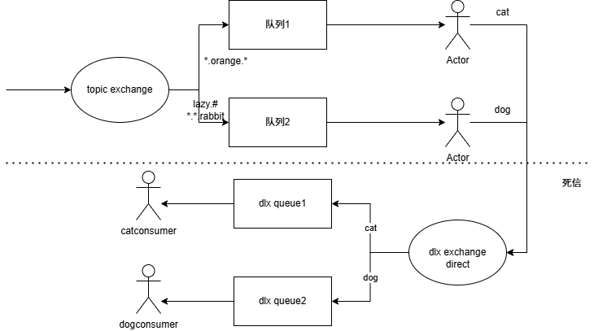

### 什么是中间件？中间件的作用？
中间件是在开发系统时，用于连接多个系统紧密协作的工具

### 消息队列
消息队列是存储消息的队列，里面含有基本的模块，比如生产者、消费者、消息、队列。

生产者将消息提交给交换机，交换机将消息转发到队列中，队列存储消息，消费者在队列中消费消息

消息队列实现了生产者与消费者之间的解耦。有异步处理、削峰填谷、消息持久化存储的优势

底层基于AMQP协议(Advanced Message Queue Protocol),
AMQP主要由生产者、消费者、交换机、队列、路由组成

交换机有四种不同的类型： `fanout` `direct` `topic` `headers`

fanout交换机转发

direct交换机路由键要和绑定键一致才能转发

topic交换机通过路由键的模糊匹配转发到匹配的队列

headers交换机根据消息头进行匹配，灵活性高，不过性能不好

### 消息队列应用场景
* 耗时的场景
* 高并发
* 分布式协作
* 强稳定性的场景

### 消息队列难点
* 需要保证消息的顺序性、一致性。
* 避免消息队列中同一条消息被重复消费

### 消息队列类型
* 工作队列 ：一条消息由一个消费者消费
* 发布订阅 ：一条消息由多个消费者消费

### rabbitmq 核心特性
1. 消息过期机制
2. 消息确认机制
3. 死信队列

### 自制死信队列流程图
